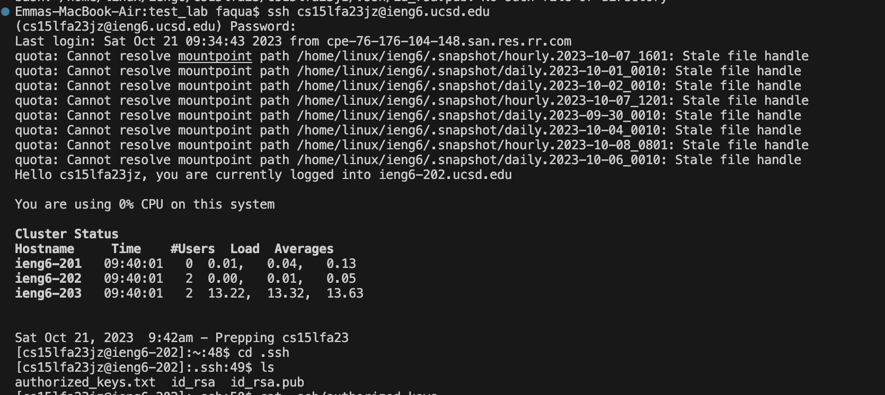
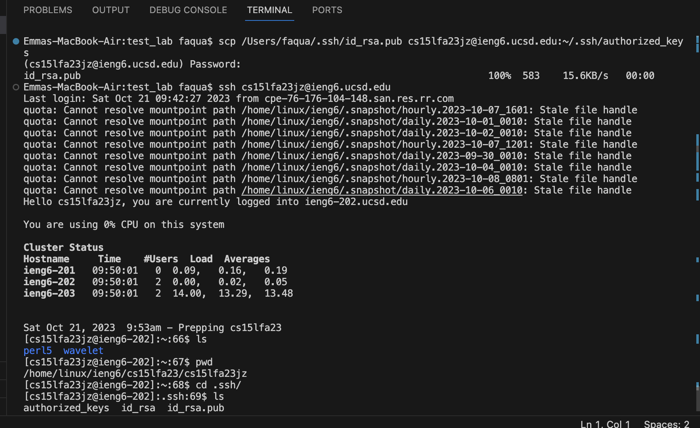

**LAB REPORT 2**
-**Emma Nguyen
-PID: A18021060**
-
**1. Part 1**
[a] The code for String Server:
-
import java.io.IOException;
import java.net.URI;

class Handler implements URLHandler {
    int num = 0;
    String str = " ";

    public String handleRequest(URI url) {
        if (url.getPath().equals("/")) {
            return(str);
        } else if (url.getPath().equals("/add-message")) {
            String[] parameters = url.getQuery().split("=");
             if (parameters[0].equals("s"))
                num += 1;
                str += "\n" + Integer.toString(num) + "." + parameters[1];
                return String.format(str + "\n");
        } 
            return "404 Not Found!";
        }
    }
    
    class StringServer {
    public static void main(String[] args) throws IOException {
        if(args.length == 0){
            System.out.println("Missing port number! Try any number between 1024 to 49151");
            return;
        }

        int port = Integer.parseInt(args[0]);

        Server.start(port, new Handler());
    }
    }
    
-
[b] Screenshots of using /add-message "Hello"

[b.1] Methods are called: getpath(), equals(), split(), getQuery(), String.format(), Integer.toString(), Integer.parseInt()
[b.2] Relevant arguments to those methods:
  -- getpath(): no argument
  -- equals("/"): argument is "/"
  -- equals("/add-message"): argument is "/add-message"
  -- equals("s"): argument is "s"
  -- Integer.toString(num): argument is "num"
  -- String.format(str): argument is "str"
  -
[b.3] The values of these relevant fields of the class:
  -- getPath().equals("/add-message"): the value is "/add-message"
  -- url.getQuery().split("="): the value is "="
  -- parameters[0].equals("s"): the value is "s"
  -- Integer.parseInt(args[0]): the value is "4000"
  -- String.format(str): the value is "1.Hello"
  -
[c] Screenshots of using /add-message "How are you"

[c.1] Methods are called: getpath(), equals(), split(), getQuery(), String.format(), Integer.toString(), Integer.parseInt()
[c.2] Relevant arguments to those methods:
  -- getpath(): no argument
  -- equals("/"): argument is "/"
  -- equals("/add-message"): argument is "/add-message"
  -- equals("s"): argument is "s"
  -- Integer.toString(num): argument is "num"
  -- String.format(str): argument is "str"
  -
[c.3] The values of these relevant fields of the class:
  -- getPath().equals("/add-message"): the value is "/add-message"
  -- url.getQuery().split("="): the value is "="
  -- parameters[0].equals("s"): the value is "s"
  -- Integer.parseInt(args[0]): the value is "4000"
  -- String.format(str): the value is "1.How are you"
  -
  -
**2. Part 2**
-
[a] The path to the private key for my SSH key for logging into ieng6

- Working directory: /home/linux/ieng6/cs15lfa23/cs15lfa23jz/.ssh
  
[b] The path to the public key for my SSH key for logging into ieng6

[c] A terminal interaction where you log into ieng6 without being asked for a password
![Log into my ieng6 course-specific account with passwork](part2-image3.png
-
-
**3. Part 3**
- There are many things that I've learned from the lab in week 2 and 3 that I did not know before:
  [1] Remotely connect to a server from your local computer by key work "ssh"
  [2] Generate a public SSH Key by run "ssh-keygen" command from my local terminal.
  [3] Be able to distinguish private SSH Key and public SSH Key.
  [4] In order not to enter password everytime log into my remote server, I can generate a public SSH Key in my local computer and copy it to the remote server.
  [5] Use "scp" command to copy a path to public SSH Key into a specific remote account.

